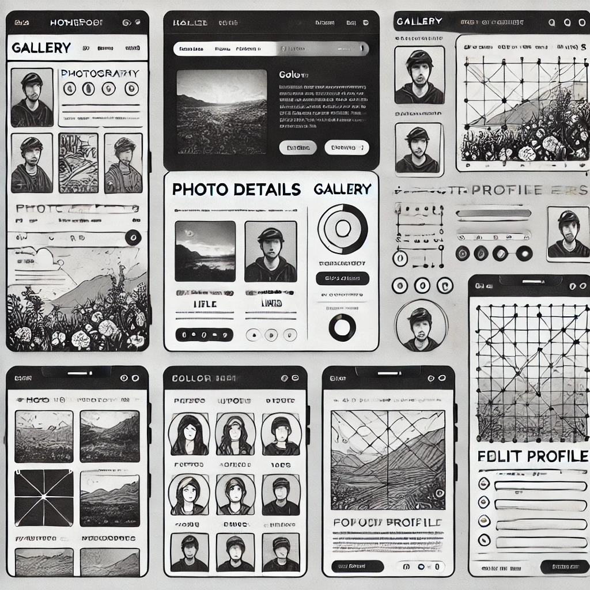
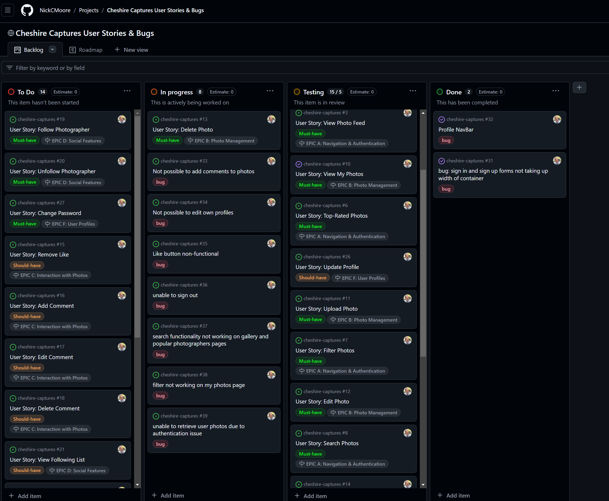

# **_Cheshire Captures_**

**Cheshire Captures** is a full-stack photography community platform designed to connect photographers and photo enthusiasts in Cheshire. Built using Django REST Framework for the backend and React for the frontend, it allows users to create accounts, upload photos, rate and comment on photos, and engage with the photography community. Users can search for photographers, filter by categories, and explore top-rated content.

The backend and frontend are deployed separately on Heroku, with the backend providing an API for data management and the frontend delivering an intuitive and responsive user experience.

[View the live platform here](https://cheshire-captures-4a500dc7ab0a.herokuapp.com/).

## Table of Contents

- [Overview](#overview)
   - [Problem Statement](#problem-statement)
   - [Target Audience](#target-audience)
   - [Solution](#solution)
- [Features](#features)
- [User Stories](#user-stories)
   - [Navigation & Authentication](#navigationauthentication)
   - [Photos](#photos)
   - [Likes & Comments](#likescomments)
   - [Following](#following)
   - [Reviews](#reviews)
   - [Profiles](#profiles)
   - [Messages](#messages)
- [Agile Approach](#agile-approach)
- [Technologies Used](#technologies-used)
   - [Backend](#backend)
   - [Frontend](#frontend)
- [API Endpoints](#api-endpoints)
- [Backend Architecture](#backend-architecture)
- [Frontend Architecture](#frontend-architecture)
- [Setup & Installation](#setup--installation)
- [Deployment](#deployment)
- [Testing](#testing)
- [Troubleshooting & Common Issues](#troubleshooting--common-issues)
- [Contributing](#contributing)
- [License](#license)
- [Credits & Acknowledgements](#credits--acknowledgements)

---

## Overview

Cheshire Captures is a platform that allows photographers to share their work and engage with the local Cheshire community. Users can upload photos, comment, rate, and interact with others. The backend API supports all functionality, while the frontend offers a smooth, mobile-friendly user experience.

### Problem Statement

Photographers often struggle to find platforms tailored to their needs, specifically for sharing high-quality images and connecting with other photographers and potential clients. General social media platforms lack focused tools, leading to missed opportunities and inadequate portfolio visibility.

### Target Audience

- Photographers: Professionals and enthusiasts who want to showcase their work, get feedback, and network with others.
- Photography Enthusiasts: Individuals passionate about photography looking to discover and engage with local photographers.
- Potential Clients: Individuals or businesses seeking photographers for events or collaborations.

### Solution

Cheshire Captures aims to address these challenges by providing a tailored platform where photographers and enthusiasts can:

-  Showcase Work: Easily upload and share high-quality photos, allowing photographers to present their portfolios in an appealing, professional manner.
- Receive Feedback: Enable community engagement through likes, ratings, and comments on photos, fostering a space for constructive criticism and appreciation.
- Network and Collaborate: Connect with fellow photographers through follow features, direct messaging, and discussions, making it easier to collaborate on projects and grow professional networks.
- Promote and Discover: Facilitate a search and filter feature to help users find photographers based on style, location, and popularity, making it easier for potential clients to discover local talent.
- Organise Portfolios: Create user-friendly profile pages where photographers can curate their best work and provide additional information about their services, making them more accessible to clients and collaborators.
- By solving these problems, Cheshire Captures aims to enhance the experience for photographers in the Cheshire area, providing them with a dedicated space to connect, collaborate, and showcase their talent. This platform not only enables better portfolio visibility and professional networking but also strengthens the local photography community by bringing photographers together in a more meaningful way.

# Features

## Navigation

The navigation bar on the site is designed to be user-friendly and responsive. It adapts based on whether the user is logged in or not. On mobile devices, the navigation collapses into a hamburger menu for ease of access.

![alt text]/public/(images/image.png)


### Logged-out Users:
When the user is logged out, the following options are visible in the navigation bar:

- **Cheshire Captures Logo**: This is a link to the homepage, displayed on the left-hand side of the navigation bar. It is visible to all users and provides quick access to the homepage.


- **Home**: This menu item links to the homepage.


- **About**: A link to the about page where users can read more about the site, its mission, and the community behind it.


- **Sign In**: This menu item links to the sign-in page, allowing returning users to log in to their accounts.


- **Sign Up**: A link to the sign-up page where new users can create an account to start interacting with the site.


### Logged-in Users:
Once a user logs in, additional options become available in the navigation bar:

- **Gallery**: Logged-in users can access the gallery page where they can view and interact with other photographers’ images.


- **Popular Photographers**: This link takes the user to a page showing the most-followed and top-rated photographers on the platform.


- **My Photos**: A link where users can view all their uploaded photos in one place.


- **Upload Photo**: This option allows users to upload new photos directly from the navigation bar.


- **Profile**: A link to the user's personal profile page, which includes their uploaded photos, followers, and personal information.


- **Sign Out**: A link that logs the user out of the platform and redirects them to the homepage.


## Authentication

Users who are new to the site can click on the **Sign Up** link to create an account. The sign-up form requests basic information such as a username, email, and password. Existing users can use the **Sign In** link to log in with their credentials. Once signed in, the **Sign Out** button becomes available, allowing users to log out securely.

- **Sign-up Form**: This form includes fields for username, email, and password. Once successfully submitted, the user is redirected to their profile page.


- **Sign-in Form**: The sign-in page asks for the user’s credentials (username and password) to log in. If the credentials are valid, the user is redirected to the homepage.


## Homepage

The homepage consists of a simple heading and strapline, drawing the user in to the site and also provided a way for new users to get signed up with the get started button.


### Popular Photographers

At the top of the homepage, a section showcases the most popular photographers on the platform based on their follower count. This section includes:

- **Profile Image**: Each popular photographer’s avatar is displayed.
- **Username**: A View Profile button, which links to their profile.
- **Follow Button**: Logged-in users can follow or unfollow photographers directly from the homepage. If the user is already following the photographer, the button will reflect that status.
- **Search**: Users can search for popular photographers.


## Profile Page

The profile page is a central feature of the site, where users can view their uploaded photos, update their profile information, and manage their social interactions.

### Profile Information

- **Profile Picture**: Users can upload a profile picture, which is displayed prominently on their profile.
- **Username**: The user's unique identifier on the platform, displayed at the top of their profile.
- **Bio**: Users can add a short biography to describe themselves or their photography style.
- **Website and Social Links**: Users can add external links to their personal website or social media profiles, such as Instagram or Twitter.

### Photo Gallery

All photos uploaded by the user are displayed in a gallery format on their profile. Each photo includes:

- **Photo Title and Description**: A title and optional description that provide context for the image.
- **Likes and Comments**: Users can see how many likes and comments their photos have received.
- **Delete/Edit Options**: Users can edit or delete their own photos directly from the profile page.

### Followers and Following

Each profile shows the number of followers the user has and the number of other users they are following. Users can click on these numbers to view a list of their followers and the profiles they follow.

## Upload Photo

Logged-in users can upload photos directly from the navigation bar. The upload form includes fields for:

- **Photo Title**: The name of the photo.
- **Description**: A short description of the image.
- **Choose an Image**: Users can upload content from their computers.


## Photo Details Page

Each photo has its own dedicated details page that includes:

- **Full-Size Image**: The photo is displayed in full size with all associated information.
- **Photographer's Profile Link**: A link back to the photographer’s profile.
- **Comments Section**: Users can leave comments on the photo. Logged-in users can interact with the comments section, while logged-out users can only view existing comments.
- **Like Button**: Users can like the photo by clicking the like button, and the like count updates in real-time.


## Comments and Likes

The platform supports commenting and liking features for user interaction. Each photo can receive comments, and users can engage in conversations. The like system allows users to show appreciation for a photo.

- **Real-Time Updates**: Comments and likes update in real-time as users interact with the platform.
- **Comment Moderation**: Users can delete comments on their own photos if they wish to moderate the discussion.

- **User Authentication:** Secure login, registration, and password resets using JWT and dj-rest-auth.
**Profile Management:** Users can update profile details and upload profile pictures.
**Photo Upload & Management: Users can upload photos, add titles, descriptions, categories, and tags.
**Interaction Features:** Comment, like/unlike, and rate photos to engage with others.
**Following System:** Users can follow other photographers.
**Search & Filter:** Search by title, photographer, or category; filter by tags or upload date.
**Top-Rated Photos:** See the most highly rated photos.
**Responsive Design:** The site is mobile-friendly and optimized for all devices.

---


## Wireframes




The wireframes were designed to provide a clear, structured layout for the main pages of the photography sharing application. Each wireframe emphasizes a clean, user-friendly interface while ensuring that key elements like photos, user interactions (comments, likes, etc.), and navigation features are prominently displayed.

Key Design Considerations:

- User Experience (UX): The wireframes are designed with user experience in mind. Navigation is intuitive, with clear call-to-action buttons and minimal distractions, allowing users to focus on the content – whether it’s viewing, uploading, or interacting with photos.

- Responsiveness: All wireframes are designed to be responsive, ensuring a seamless experience across devices, including desktop, tablet, and mobile views. The layout automatically adjusts to provide the best user experience based on the screen size.

- Minimalist Approach: The design follows a minimalist approach, focusing on functionality with minimal use of colour. Black, white, and gray shades dominate the interface to provide a neutral background that emphasizes the user-generated content, primarily the photos.

Wireframe Breakdown:

Homepage Wireframe:

Header: Includes a site logo and navigation bar with links to the gallery, user profile, login, and sign-up options.
Hero Section: Features a large call-to-action (CTA) button inviting users to explore or upload photos. The background is minimal to allow users to focus on the navigation options.
Photo Feed: Below the hero section, a grid of photos is displayed, showcasing the latest or most popular images. Each photo is accompanied by details such as the photographer’s name, the number of likes, and a comments section preview.

Profile Page Wireframe:

Profile Image & Bio: A simple user card displaying the photographer's profile image, display name, bio, and social media links. An "Edit Profile" button is available for the logged-in user to make changes to their profile.
Photos Section: Below the profile details, the photographer's uploaded photos are showcased in a grid format. Each photo has an "Edit" and "Delete" option (if viewed by the profile owner).

Photo Upload Wireframe:

Form Layout: A clean, centered form with fields for title, description, and image upload. The image upload button is designed to be prominent to encourage users to upload a photo.
Preview Section: Once an image is selected, a preview is displayed before the user submits the form, ensuring they can make changes if necessary.

Photo Detail Wireframe:

Photo Display: The main photo takes center stage, displayed prominently with like and comment buttons below it.
Photographer Information: Located beside or below the photo is a section highlighting the photographer’s details with a link to their profile.
Comment Section: Users can view and add comments to the photo. Logged-in users can edit or delete their own comments.
Interactions: Like and unlike buttons are placed below the photo to allow quick interaction, with a visible counter of likes and comments.

Login/Sign-up Wireframes:

Form Layout: The login and sign-up forms are simple, with fields for username, password, and optional social media login options. Both forms are centered for focus and ease of use, with clear instructions and feedback mechanisms for incorrect input.

Wireframe Tools:

The wireframes were initially conceptualized using basic layout sketches and later refined into a detailed, digital format. The digital wireframes are black and white, emphasizing structure and functionality. All diagrams use simple shapes and line art to represent the structure, providing a clear roadmap for development without overcomplicating the visual details.

The wireframes serve as a reference for both front-end and back-end development, ensuring that the user experience flows as intended and that all functional requirements are met.

Design Overview:

The design of this website adopts a modern, minimalist aesthetic, emphasizing user-generated content (primarily photos) while maintaining a clean, cohesive visual theme. The colours, fonts, and layout elements are carefully selected to create an elegant, approachable experience for users. The overall structure leverages a neutral yet vibrant colour scheme that balances professionalism and creativity.

## Colour Scheme:

The following colours are central to the design, creating a harmonious and visually appealing atmosphere:

- Rich Black (#0e1116): Used for the background of scrollbars and some structural elements, providing a deep, neutral base.
- Yinmn Blue (#374a67): This cool blue shade is the dominant background colour, evoking a calm, professional atmosphere.
- Ultra Violet (#616283): A subtle yet distinct accent colour for borders, shadows, and hover states on certain buttons and images.
- Mountbatten Pink (#9e7b9b): Applied to links, buttons, and some icon hover effects, this colour adds a touch of elegance and attention to user interaction points.
- Wisteria (#cb9cf2): A soft lavender shade used primarily for the hover state of links and buttons, providing a contrast with the Mountbatten Pink and creating a fresh, engaging feel.
- Rose Quartz (#bca3ac): A muted, warm pink used in background elements, contributing to a soft, approachable aesthetic.
- Thistle (#e5cedc): A light pastel shade, incorporated in areas requiring subtle contrasts.
Magnolia (#f3eaf4): A pale yellowish-pink used for headings and key content elements to create emphasis and readability.
- Lavender Blush (#eadde1): A light pastel used in specific accents to provide a delicate, refined touch.

## Typography:

The typography has been chosen to balance modernity with readability:

- Font Family: The primary typeface used across the site is Montserrat, a clean and versatile sans-serif font that enhances clarity and legibility.
- Font Size and Weight:
Headings (h1) are prominent at 2.5rem, providing a strong visual hierarchy.
Body text is set at 1rem, ensuring ease of reading across all devices.
Bold text is used sparingly, for emphasis on key elements, especially headings and buttons.

## Layout and Styling:

The layout is driven by simplicity and user interaction. The use of Bootstrap for responsive grid design ensures the site is optimized for all screen sizes. Key UI elements like buttons, images, and forms are styled with a minimal yet polished approach to guide users through the interface.

- Main Container: The .Main class introduces padding to adjust the layout for various screen sizes and ensures elements do not touch the edges of the viewport.
- Button Styling: Buttons are designed with rounded corners, subtle shadows, and transitions to enhance user interaction. The primary button has a base colour of Mountbatten Pink with a hover effect transitioning to Ultra Violet.
- Image Frames: Images, including photos and icons, are given soft borders (Ultra Violet) and gentle box shadows for a modern, elevated look. Hover effects are applied to give a sense of interaction.

### User Stories

## Navigation/Authentication

1. **Log In:**

   - _Explanation:_ As a user, I can log in so that I can interact fully with the site. `(MUST HAVE)`

   **Acceptance Criteria:**
   
   - Log in form is accessible from any page.
   - User is prompted to enter username and password.
   - Successful log in redirects to the homepage.

2. **Sign Up:**

   - _Explanation:_ As a user, I can sign up so that I can create an account to upload and share my photos. `(MUST HAVE)`

   **Acceptance Criteria:**
   
   - Sign up form is accessible from any page.
   - User is prompted to enter a username, email, and password.
   - Successful sign up redirects to a welcome page.

3. **View Gallery:**

   - _Explanation:_ As a user, I can view the homepage gallery so that I can see a curated list of photos. `(MUST HAVE)`

   **Acceptance Criteria:**
   
   - Homepage displays a grid of recent photos.
   - Each photo shows a thumbnail and basic details.
   - Page loads more photos as the user scrolls.

4. **Photo Details:**

   - _Explanation:_ As a user, I can view details of a single photo so that I can see more information and interactions. `(MUST HAVE)`

   **Acceptance Criteria:**
   
   - Clicking on a photo shows the full-size image.
   - Photo details include title, description, and photographer.
   - User can see interactions like likes and comments.

5. **Popular Photographers:**

   - _Explanation:_ As a user, I can view popular photographers so that I can discover new talents. `(MUST HAVE)`

   **Acceptance Criteria:**
   
   - List of popular photographers based on followers.
   - User can view profile summary of each photographer.
   - User can follow photographers from this page.

6. **Top-Rated Photos:**

   - _Explanation:_ As a user, I can view the top-rated photos so that I know which photos are most appreciated. `(MUST HAVE)`

   **Acceptance Criteria:**
   
   - Displays photos sorted by average rating.
   - Shows the number of ratings for each photo.
   - User can navigate to photo details from here.

7. **Filter Photos:**

   - _Explanation:_ As a user, I can filter photos by category so that I can find photos that match my interests. `(MUST HAVE)`

   **Acceptance Criteria:**
   
   - Categories are displayed as a dropdown or list.
   - User can select one or more categories.
   - Page updates to show only matching photos.

8. **Search Photos:**

   - _Explanation:_ As a user, I can search photos by keywords, photographer, or location so that I can find specific content. `(MUST HAVE)`

   **Acceptance Criteria:**
   
   - Search bar is available on all pages.
   - User can search by keyword, photographer, or location.
   - Search results update in real-time.

9. **View Comments:**

   - _Explanation:_ As a user, I can view comments on a photo so that I can see what other users think about it. `(MUST HAVE)`

   **Acceptance Criteria:**
   
   - Each photo displays a comment count.
   - Clicking on the count shows a list of comments.
   - Comments are sorted by most recent.

## Photos

1. **View My Photos:**

   - _Explanation:_ As a registered user, I can see a list of all my uploaded photos so that I can manage them. `(MUST HAVE)`

   **Acceptance Criteria:**
   
   - Displays all photos uploaded by the user.
   - User can click on a photo to view or edit details.
   - User can filter photos by upload date.

2. **Upload Photo:**

   - _Explanation:_ As a registered user, I can upload a new photo so that I can share my work with the community. `(MUST HAVE)`

   **Acceptance Criteria:**
   
   - Photo upload form is accessible from the user menu.
   - User can upload an image file and add details.
   - Successful upload shows the photo in the gallery.

3. **Edit Photo:**

   - _Explanation:_ As a registered user, I can edit my uploaded photo details so that I can update the information. `(MUST HAVE)`

   **Acceptance Criteria:**
   
   - User can edit details like title and description.
   - Changes are saved and updated immediately.
   - User is notified of successful update.

4. **Delete Photo:**

   - _Explanation:_ As a registered user, I can delete my photos so that I can remove content I no longer want to share. `(MUST HAVE)`

   **Acceptance Criteria:**
   
   - Each photo includes an option to delete.
   - User is prompted to confirm before deletion.
   - Deleted photos are removed from the profile and gallery.

## Likes/Comments

1. **Like Photo:**

   - _Explanation:_ As a registered user, I can like a photo so that I can show my appreciation for it. `(SHOULD HAVE)`

   **Acceptance Criteria:**
   
   - Each photo has a like button for interaction.
   - User can see the total like count for the photo.
   - User can only like a photo once.

2. **Remove Like:**

   - _Explanation:_ As a registered user, I can remove my like from a photo so that I can change my interaction. `(SHOULD HAVE)`

   **Acceptance Criteria:**
   
   - Liked photos have the like button highlighted.
   - Clicking again removes the like and updates the count.
   - User can see all their liked photos in a list.

3. **Add Comment:**

   - _Explanation:_ As a registered user, I can add a comment to a photo so that I can share my thoughts on it. `(SHOULD HAVE)`

   **Acceptance Criteria:**
   
   - Each photo has a comment box below it.
   - User can type a comment and submit.
   - Submitted comments are immediately visible.

4. **Edit Comment:**

   - _Explanation:_ As a registered user, I can edit my comment so that I can correct or update my opinion. `(SHOULD HAVE)`

   **Acceptance Criteria:**
   
   - User can edit their comment by clicking an edit button.
   - Edited comments show an 'edited' label.
   - Changes are saved and visible to all users.

5. **Delete Comment:**

   - _Explanation:_ As a registered user, I can delete my comment so that I can remove it if necessary. `(SHOULD HAVE)`

   **Acceptance Criteria:**
   
   - Each comment has a delete button for the author.
   - User is prompted to confirm before deletion.
   - Deleted comments are removed immediately.

## Following

1. **Follow Photographer:**

   - _Explanation:_ As a registered user, I can follow another photographer so that I can see their new posts in my feed. `(MUST HAVE)`

   **Acceptance Criteria:**
   
   - Each photographer profile has a follow button.
   - Clicking follow adds the photographer to the user feed.
   - Followed photographers' new posts appear in the feed.

2. **Unfollow Photographer:**

   - _Explanation:_ As a registered user, I can unfollow a photographer so that I no longer see their updates. `(MUST HAVE)`

   **Acceptance Criteria:**
   
   - Unfollow button appears for followed photographers.
   - Clicking unfollow removes them from the user feed.
   - User is prompted to confirm the unfollow action.

3. **View Following List:**

   - _Explanation:_ As a registered user, I can view all the photographers I follow so that I can manage my list. `(SHOULD HAVE)`

   **Acceptance Criteria:**
   
   - List of followed photographers is accessible from the menu.
   - Shows recent activity of followed photographers.
   - User can unfollow from this list
## Reviews

1. **View Top-Rated Photos:**

   - _Explanation:_ As a registered user, I can view all the top-rated photos so that I can discover popular content. `(COULD HAVE)`

   **Acceptance Criteria:**
   
   - Displays photos sorted by average rating.
   - Shows the number of ratings for each photo.
   - User can navigate to photo details from here.

2. **Rate Photo:**

   - _Explanation:_ As a registered user, I can rate a photo so that I can share my opinion on its quality. `(SHOULD HAVE)`

   **Acceptance Criteria:**
   
   - User can rate a photo with stars (1-5).
   - Rating appears on the photo immediately.
   - User can edit or delete their rating.

3. **View My Ratings:**

   - _Explanation:_ As a registered user, I can view all my ratings so that I can manage them. `(COULD HAVE)`

   **Acceptance Criteria:**
   
   - List of user ratings is accessible from the menu.
   - User can view or edit their ratings.
   - User can delete any of their ratings.

## Profiles

1. **View Profile:**

   - _Explanation:_ As a user, I can view the profile page of a photographer so that I can see more details about their work. `(MUST HAVE)`

   **Acceptance Criteria:**
   
   - Displays profile information of the photographer.
   - Shows their photos, bio, and social links.
   - User can follow/unfollow from the profile page.

2. **Update Profile:**

   - _Explanation:_ As a registered user, I can update my profile information so that I can keep my details up-to-date. `(SHOULD HAVE)`

   **Acceptance Criteria:**
   
   - Profile edit form accessible from the user menu.
   - User can update bio, profile picture, and social links.
   - Changes are saved and updated immediately.

3. **Change Password:**

   - _Explanation:_ As a registered user, I can change my password so that I can keep my account secure. `(MUST HAVE)`

   **Acceptance Criteria:**
   
   - Password change form is accessible from user settings.
   - User must enter the current password for verification.
   - User can set a new password after verification.

## Messages

1. **View Messages:**

   - _Explanation:_ As a registered user, I can view messages in my profile page so that I can read messages other users have sent me. `(COULD HAVE)`

   **Acceptance Criteria:**
   
   - User can access inbox from the profile page.
   - Shows list of received messages sorted by date.
   - User can click on a message to view details.

2. **Send Message:**

   - _Explanation:_ As a registered user, I can send a message to another user so that I can ask a question about their work. `(SHOULD HAVE)`

   **Acceptance Criteria:**
   
   - Message form accessible from user profile or photo.
   - User can type and send a message to another user.
   - Message appears in the recipient's inbox immediately.

3. **Delete Message:**

   - _Explanation:_ As a registered user, I can delete a message so that I can remove it from my inbox. `(COULD HAVE)`

   **Acceptance Criteria:**
   
   - Each message has a delete option.
   - User is prompted to confirm deletion.
   - Deleted messages are removed from the inbox.


## Agile Approach

The development process for Cheshire Captures followed Agile methodology, emphasising continuous improvement throughout the development lifecycle.

### Project Management

GitHub Projects served as the primary Agile tool for managing the development tasks. While GitHub Projects isn't a specialised Agile tool, it was used with the right tags, project creation, and issue assignments to fit the needs of the project.


### User Stories Mapping

User stories were crucial in mapping out the development progress. They were categorised into EPICs A, B, C, D, E, and F based on user types and content specificity. The user stories were organised on a Kanban board, providing a visual representation of the backlog and the current status of tasks. The MoSCoW method was used to prioritise these stories, categorising them into Must have, Should have, Could have, and Won't have, ensuring that the most critical features were developed first.

### Kanban Board

The basic Kanban board in GitHub Projects (see above) helped visualise the workflow and track the progress of tasks. Tasks moved across columns from the backlog, through development stages, to testing, and finally to completion. This setup provided clarity on the workload and helped in managing the project efficiently.



### Continuous Improvement

Despite working solo on this project, continuous improvement was a key focus. Regular retrospectives allowed reflection on past work, identification of areas for improvement, and thinking through possible solutions. This practice ensured that the development processes and product quality were consistently enhanced.

For a detailed view of the project management and task progression, refer to the [GitHub Project board](https://github.com/NickCMoore/cheshire-captures/projects?query=is%3Aopen).


## Technologies Used

### Backend

- **Django (v5.1.2)**: The core Python web framework used to develop the backend of the application, enabling rapid and secure development.
- **Django REST Framework (v3.14.0)**: Provides powerful tools to create the RESTful API that connects the backend to the React frontend.
- **PostgreSQL**: A relational database system used to manage all data related to users, photos, comments, and interactions.
- **Cloudinary (v1.41.0)**: A cloud-based service used for storing and managing image uploads, making it easier to serve user-uploaded media across the platform.
- **Heroku**: The cloud platform used for deploying the backend of the project, ensuring scalability and reliable hosting.
- **Gunicorn (v20.1.0)**: A Python WSGI HTTP server used to run the Django application on Heroku in production.
- **Whitenoise (v6.7.0)**: Ensures efficient serving of static files directly from the Django application in production environments.

### Frontend

- **React**: A JavaScript library used to build the user interface, enabling a dynamic and responsive experience for users.
- **React-Bootstrap**: Provides pre-built, responsive components to create a clean and visually consistent design across the site.
- **Axios (v1.4.0)**: Handles API requests between the React frontend and the Django REST API, allowing the front-end to communicate with the back-end seamlessly.
- **FontAwesome**: A widely-used icon library for adding scalable vector icons throughout the application, enhancing the user experience.
- **Heroku**: Also used to deploy the frontend of the project, ensuring a fully hosted and easily accessible application.
- **React Simple Star Rating**: A React component package used to implement the star rating system for photos, allowing users to rate content easily.
- **React Router Dom**: Used for managing routing and navigation between different pages within the React frontend.


---

## API Endpoints

### Authentication

- **Login**: `POST /dj-rest-auth/login/`
- **Logout**: `POST /dj-rest-auth/logout/`
- **Registration**: `POST /dj-rest-auth/registration/`
- **Resend Registration Email**: `POST /dj-rest-auth/registration/resend-email/`
- **Verify Registration Email**: `POST /dj-rest-auth/registration/verify-email/`
- **Password Change**: `POST /dj-rest-auth/password/change/`
- **Password Reset**: `POST /dj-rest-auth/password/reset/`
- **Password Reset Confirm**: `POST /dj-rest-auth/password/reset/confirm/`
- **Token Refresh**: `POST /dj-rest-auth/token/refresh/`
- **Token Verify**: `POST /dj-rest-auth/token/verify/`
- **User Details**: `GET /dj-rest-auth/user/`
- **Update User**: `PUT /dj-rest-auth/user/`
- **Partial Update User**: `PATCH /dj-rest-auth/user/`

### Photos

- **Get All Photos**: `GET /api/photos/photos/`
- **Create a Photo**: `POST /api/photos/photos/`
- **Get My Photos**: `GET /api/photos/photos/my_photos/`
- **Top-Rated Photos**: `GET /api/photos/photos/top-rated/`
- **Photo Details**: `GET /api/photos/photos/{id}/`
- **Edit Photo**: `PUT /api/photos/photos/{id}/`
- **Partial Update Photo**: `PATCH /api/photos/photos/{id}/`
- **Delete Photo**: `DELETE /api/photos/photos/{id}/`
- **Rate Photo**: `POST /api/photos/photos/{id}/rate/`
- **Get Photo Ratings**: `GET /api/photos/photos/{id}/ratings/`
- **Like Photo**: `POST /api/photos/photos/{id}/like/`
- **Unlike Photo**: `POST /api/photos/photos/{id}/unlike/`
- **Get Photo Comments**: `GET /api/photos/photos/{id}/comments/`
- **Create Photo Comment**: `POST /api/photos/photos/{id}/comments/`
- **Get Photo Tags**: `GET /api/photos/tags/`
- **Create Photo Tag**: `POST /api/photos/tags/`

### Comments

- **Get All Comments**: `GET /api/photos/comments/`
- **Create a Comment**: `POST /api/photos/comments/`
- **Delete a Comment**: `DELETE /api/photos/comments/{id}/`

### Follows

- **Get All Follows**: `GET /api/photographers/follows/`
- **Follow a Photographer**: `POST /api/photographers/follows/`
- **Unfollow a Photographer**: `POST /api/photographers/follows/{id}/unfollow/`

### Photographers

- **Get All Photographers**: `GET /api/photographers/photographers/`
- **Photographer Details**: `GET /api/photographers/photographers/{id}/`
- **Update Photographer**: `PUT /api/photographers/photographers/{id}/`
- **Partial Update Photographer**: `PATCH /api/photographers/photographers/{id}/`
- **Follow a Photographer**: `POST /api/photographers/photographers/{id}/follow/`
- **Unfollow a Photographer**: `DELETE /api/photographers/photographers/{id}/follow/`
- **Get Photographer's Followers**: `GET /api/photographers/photographers/{id}/followers/`
- **Top Photographers**: `GET /api/photographers/top-photographers/`

### Messages

- **Get All Messages**: `GET /api/messages/messages/`
- **Create a Message**: `POST /api/messages/messages/`
- **Message Details**: `GET /api/messages/messages/{id}/`
- **Update Message**: `PUT /api/messages/messages/{id}/`
- **Partial Update Message**: `PATCH /api/messages/messages/{id}/`
- **Delete Message**: `DELETE /api/messages/messages/{id}/`


## Backend Architecture

### Models

- **User**: Includes user information and authentication.
- **Photographer**: Extends the user model with profile-specific data.
- **Photo**: Represents uploaded photos, with attributes like title, description, image URL, and ratings.
- **Comment**: Represents user comments on photos.
- **Like**: Stores user likes on photos.
- **Follow**: Manages following relationships between photographers.

### Pagination

- **StandardResultsSetPagination**: Used for paginating results in various endpoints.

### Filtering & Searching

- Utilises `django-filters` for filtering by category, tags, and date ranges.
- Supports search queries for photo titles, descriptions, and photographers.

---

## Frontend Architecture

### Key Components

- **NavBar**: Provides navigation across the app based on user authentication status.
- **PhotoDetails**: Displays detailed information about a specific photo, including comments and ratings.
- **Profile**: Shows a photographer’s profile information and their photos.
- **MyPhotos**: Displays a logged-in user's uploaded photos with options to filter by upload date.
- **Gallery**: A carousel-based gallery that displays photos.

### Routing

- Uses `react-router-dom` for routing:
  - `"/"`: Home page.
  - `"/signin"`: Sign in page.
  - `"/signup"`: Registration page.
  - `"/gallery"`: Displays all photos.
  - `"/photos/:id"`: Photo details page.
  - `"/profile/:id"`: User profile page.
  - `"/profile/:id/edit"`: Edit profile page.
  - `"/my-photos"`: View and manage photos uploaded by the user.
  - `"/top-rated"`: Displays top-rated photos.
  - `"/popular-photographers"`: View popular photographers.
  - `"/search"`: Search for photos or photographers by keyword.
  - `"/comments/:photoId"`: View comments for a specific photo.
  - `"/messages"`: View all messages.
  - `"/messages/:id"`: View specific message details.


---

## Testing

Please click  to read more information about testing Cheshire Captures

## Setup & Installation

### Prerequisites

- **Backend**: Python 3.8+, PostgreSQL, Cloudinary account.
- **Frontend**: Node.js, npm.

## Backend Setup

### Prerequisites

- Python 3.10 or newer
- Django 4.2 or newer
- PostgreSQL 13 or newer
- Git

# Deployment Guide

## Deployment to Heroku

Once you have set up a new Gitpod workspace and your project is ready, follow the steps below to deploy your application to Heroku.

### Step 1: Create a New Heroku App

1. Log in to your Heroku account.
2. On the dashboard, click the **Create New App** button.
3. Choose a **unique name** for your app that relates to your project.
4. Select the appropriate **region** based on your location.
5. Click **Create App** to proceed.

### Step 2: Deploy the Application

1. After creating the app, navigate to the **Deploy** tab in Heroku.
2. In the **Deployment method** section, choose **GitHub**.
3. Connect your GitHub account (if not already connected) and find your **project repository**.
4. Once connected, select the branch you wish to deploy (usually `main` or `master`) and click **Deploy Branch**.
5. Heroku will now start building your application. Wait for the **build succeeded** message.
6. After the build is complete, click **Open App** to view your application in the browser.

## Connecting React Frontend to the API Backend

Once the basic deployment is complete, follow these steps to connect your React frontend to your API backend for seamless data exchange.

### Step 1: Set Environment Variables in Heroku

1. In your Heroku dashboard, navigate to your **API application's settings**.
2. Scroll down to the **Config Vars** section and click **Reveal Config Vars**.
3. Add the following config variables:
   - **CLIENT_ORIGIN**: This should be the URL of your deployed React application (e.g., `https://myapp-react.herokuapp.com`).
   - **CLIENT_ORIGIN_DEV**: This is the URL of your Gitpod workspace (e.g., `https://3000-yourproject.gitpod.io`). Make sure to remove any trailing slashes from the URL.


   > **Note:** Gitpod occasionally changes this URL, so make sure to update this config variable as needed during development.

### Step 2: Set Up Axios in React

1. In your React frontend Gitpod workspace, open a terminal and install Axios by running:

```
npm install axios
```

2. Create a folder named API and inside it, create a file called axiosDefaults.js.

3. In axiosDefaults.js, set up Axios defaults by importing Axios and configuring the base URL for your API:

```
import axios from 'axios';

axios.defaults.baseURL = 'https://your-api-backend.herokuapp.com/';
axios.defaults.headers.post['Content-Type'] = 'multipart/form-data';
axios.defaults.withCredentials = true;
```

Note: Replace 'https://your-api-backend.herokuapp.com/' with the actual URL of your deployed API project.

4. To ensure Axios is set up across your React app, import this file into your main App.js file:

```
import './API/axiosDefaults';
```

5. Now, your React frontend is ready to communicate with the API backend for sending and receiving data, including handling images with the correct content type.

## Forking the Project Repository

If you'd like to make an independent copy of the project repository, you can fork it on GitHub. Forking allows you to make changes to the repository without affecting the original.

### Steps to Fork a Repository:

1. Log into your GitHub account and navigate to the repository you want to fork.
2. In the top-right corner of the repository page, click the **Fork** button.
3. GitHub will create a copy of the original repository under your account, allowing you to modify it independently.
4. Once forked, you can make changes to your copy without impacting the original project.

## Cloning the Project Repository

A Git clone creates a local copy of a GitHub repository on your machine that stays linked to the original repository. This allows you to pull updates and push changes as needed.

### Steps to Clone a Repository:

1. On the GitHub repository page, click the **Code** button.
2. In the dropdown, select **Clone** and choose your preferred method:
   - **HTTPS**: Copy the HTTPS link to clone the repository.
   - **SSH**: Use SSH for a secure connection if you have it set up.
3. Open a terminal and run the following command to clone the repository:

```
git clone https://github.com/your-username/repository-name.git
```

Note: Replace your-username and repository-name with your GitHub username and the repository name.

4. After cloning, navigate into the project directory:

```
cd repository-name
```
5. You can now make changes to the project locally. Any updates you make can be pushed back to the repository.

## Credits

This project would not have been possible without the help of several resources, tools, and inspirations that guided my development process. Below is a detailed list of all the elements that contributed to various aspects of this project.

- The background images used on the **Sign In** and **Sign Up** pages were sourced from [Unsplash](https://unsplash.com), an incredible resource for free, high-quality photography. Special thanks to the photographers who shared their work.
  
- For the **Upload Image** icons used in the **Create Photo**, **Edit Photo**, and **Profile Edit** pages, I used [Pngtree](https://pngtree.com), which provided the perfect visual elements for these features. Their extensive library made it easy to find icons that matched the aesthetic of the site.

- The **No Results Found** placeholder image, displayed when a user search returns no results, was customized from a template provided by **Hajde/Media**. It ensures that users have a clear visual cue when there’s no matching content.

- The logo for **Cheshire Captures** was designed using [FreeLogoDesign.org](https://www.freelogodesign.org). I started with their free design templates and tailored them to match the unique identity of the platform.

- To refine the branding, I used [Fotor](https://www.fotor.com) to make the logo’s background transparent, allowing it to integrate seamlessly across different colour schemes on the site.

- When implementing the **Delete Confirmation Modal** for managing posts and comments, I consulted an insightful article shared by tutor support. It provided a foundational understanding of modal creation in React, which I then adapted to suit the functionality required in this project.

- After building the initial version of the modal, I found a helpful guide on refactoring components to ensure the **Delete Confirmation Modal** became reusable across different sections of the site, such as the photo deletion and profile management areas.

- For implementing the date-based filtering in the **Gallery** section, I relied on an excellent [Stack Overflow thread](https://stackoverflow.com). This allowed me to dynamically filter photos by their upload date and provide users with real-time sorting options based on the latest content.

- Another [Stack Overflow article](https://stackoverflow.com) helped me address a persistent React console warning about the correct usage of component brackets. This fix improved the performance and code readability of the project, especially when handling the **Top-Rated Photos** component.

- The logic for setting a **dynamic date variable** (used for showing the most recent content) was inspired by a tutorial on [ReactGo.com](https://www.reactgo.com). This tutorial provided a simple yet powerful method to ensure the homepage and profile pages always show up-to-date information.

- To implement the **React Simple Star Rating** feature for user reviews, I referred to documentation from the package itself. However, I also took inspiration from my mentor, who used a similar rating system in a previous project, helping me understand how to customize the component for this platform.

- The official documentation for the **Star Rating System** helped me properly install and customize the component to suit the needs of the platform, ensuring seamless integration for rating photos in the **Photo Detail** view.

- The **Code Institute DRF Walkthrough Project** from Code Institute also provided key guidance on structuring the back-end API for Cheshire Captures. By reviewing how Django Rest Framework was used in the walkthrough, I was able to apply similar strategies for user authentication, photo management, and rating systems.

- A significant portion of the React front-end for this project was built by following Code Institute’s **Moments Walkthrough Project**. This walkthrough was instrumental in helping me understand how to structure a modern front-end with React, including handling authentication, CRUD operations, and state management. The **Moments** project particularly helped in implementing features like the **Gallery Feed**, where users can scroll through a series of images, and the **Profile Page**, where users can manage their photos.


## Acknowledgements

This project was developed as part of **Portfolio Project #5** (Advanced Front-End Specialization) for the **Diploma in Full Stack Software Development** at the **Code Institute**. I am incredibly grateful for the support and guidance of my mentor, **Gareth McGirr**, who provided valuable feedback and insight throughout the development process.

A huge thanks to the **Cheshire Captures** community, whose input inspired many of the user-driven features in this platform. Additionally, I’d like to extend my appreciation to my peers and tutors at the Code Institute for their constant encouragement and willingness to answer questions—especially on the **Slack** channels. Your support helped me overcome numerous challenges during the development process.

Lastly, I want to acknowledge the vast array of online resources and communities—particularly **Unsplash**, **Pngtree**, **Stack Overflow**, and **GitConnected**—for offering the tutorials, tools, and assets that helped bring this project to life.

**[Nick Moore]**, [October] [2024]


