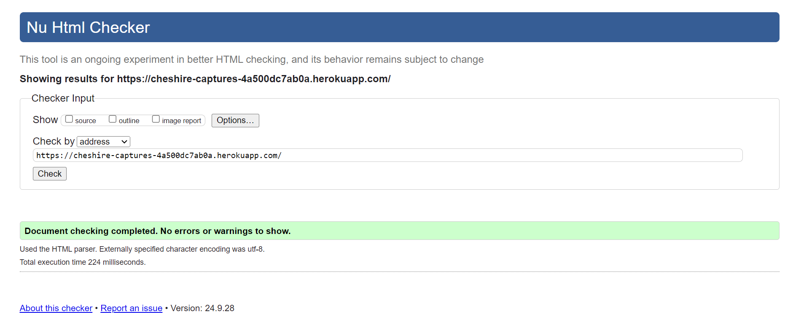
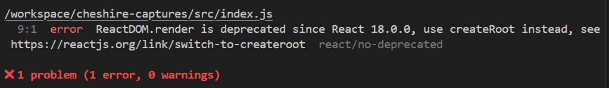
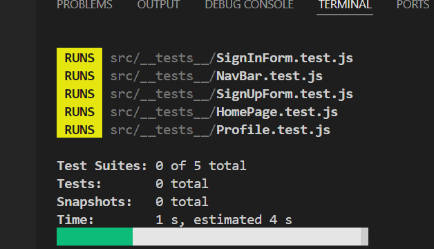
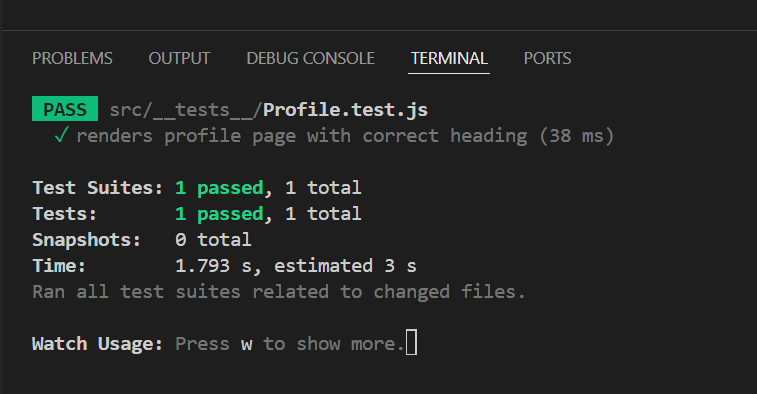

# **Cheshire Captures**

# Frontend Testing

## Table of Contents

* [**Testing**](<#testing>)
    * [Code Validation](<#code-validation>)
    * [Automatic Testing](<#automatic-testing>)
    * [Manual Testing](<#manual-testing>)
    * [Responsiveness Testing](<#responsiveness-testing>)
    * [Lighthouse Testing](<#lighthouse-testing>)
    * [Known Bugs](<#known-bugs>)

## Code Validation 

The Cheshire Captures site has been passed through the [W3C HTML Validator](https://validator.w3.org/), the [W3C CSS Validator](https://jigsaw.w3.org/css-validator/), and the [ESLint Validator](https://eslint.org/docs/latest/use/getting-started#next-steps) to ensure code quality and syntax standards.

### W3C HTML Validation Results

No errors were found when the deployed Cheshire Captures URL was passed through the W3C HTML validation checker. Only some informational notes regarding the meta tags in the index.html file were logged.

### W3C CSS Validation Results

No errors or warnings were found when the deployed Cheshire Captures URL was passed through the W3C CSS validation checker.

### ESLint Validation Results

After resolving errors due to unused imports in React files, only warning remaining was related to use of ReactDOM.render. This project was built on React 17, so introducing this would've caused errors with the running of the application. This was left. ESLint was uninstalled afterward to avoid conflicts with other dependencies.

## Automatic Testing

The following Jest tests were written to ensure the main components of the Cheshire Captures frontend rendered correctly:

Here are some of the results:

### NavBar.js
|  | | |
|:-------:|:--------|:--------|
| Renders Navbar Home link| &check; |
| Renders link to the gallery feed for a logged-in user | &check; |
| Renders link to popular photographers for a logged-in user | &check; |

### NotFound.js
|  | | |
|:-------:|:--------|:--------|
| Go Back to homepage link renders | &check; |

### Profile.js
|  | | |
|:-------:|:--------|:--------|
| Profile component renders | &check; |
| Profile owner's details render | &check; |

## Manual Testing

In addition to the automated tests, the following manual tests were conducted to ensure functionality aligns with user stories:

| Status | **Authentication - User Logged Out**
|:-------:|:--------|
| &check; | Attempting to visit a protected URL (e.g., `/gallery`) redirects to the homepage.
| &check; | The login and sign-up forms are displayed correctly on both desktop and mobile.
| &check; | Invalid login attempts display appropriate error messages.

| Status | **Navigation - User Logged Out**
|:-------:|:--------|
| &check; | Clicking the brand logo in the navbar navigates to the homepage.
| &check; | Navbar links for login and sign-up are visible for logged-out users.
| &check; | Users can't see profile or gallery feed links in the navbar.

| Status | **Homepage - User Logged Out**
|:-------:|:--------|
| &check; | Popular photographers and top-rated photos display on the homepage.
| &check; | Clicking on a photographer's profile or photo redirects to the respective detail page.
| &check; | Users can search for photographers by name or filter photos by category.

| Status | **Event Detail Page - User Logged Out**
|:-------:|:--------|
| &check; | Users can view details of photos, including ratings and comments.
| &check; | Users can see comments but can't post without logging in.

| Status | **Profile Page - User Logged In**
|:-------:|:--------|
| &check; | Users can view their profile and update details, including bio and social links.
| &check; | Users can follow or unfollow other photographers.

## Responsiveness Testing

The site was manually tested across different device sizes using Google Chrome Dev Tools and [Responsive Design Checker](https://www.responsivedesignchecker.com/). The main design was focused on desktop users, but tablet and mobile breakpoints were also implemented.

### Mobile Devices

||
iPhone 11

414 x 896
|
Samsung Galaxy S10

360 x 740
|
Google Pixel 4

411 x 823
|
| :- | :-: | :-: | :-: |
| Render | Pass | Pass | Pass |
| Images | Pass | Pass | Pass |
| Links | Pass | Pass | Pass |

### Tablet Devices

||
Apple iPad

768 x 1024
|
Samsung Galaxy Tab S6

800 x 1280
|
Amazon Kindle Fire

600 x 1024
|
| :- | :-: | :-: | :-: |
| Render | Pass | Pass | Pass |
| Images | Pass | Pass | Pass |
| Links | Pass | Pass | Pass |

### Desktop Devices

||
24" Desktop

1920 x 1080
|
15" Laptop

1440 x 900
|
13" Notebook

1280 x 800
|
| :- | :-: | :-: | :-: |
| Render | Pass | Pass | Pass |
| Images | Pass | Pass | Pass |
| Links | Pass | Pass | Pass |

### Browser Compatibility 

Cheshire Captures was tested on the following browsers:

- Google Chrome
- Microsoft Edge
- Mozilla Firefox

The site worked consistently across these browsers, though minor layout discrepancies were noted in Mozilla Firefox due to CSS flex properties.

## Lighthouse Testing

Google Lighthouse was used to test the site's performance, accessibility, best practices, and SEO:

* Homepage Performance: 85, Accessibility: 90, Best Practices: 89, SEO: 95

## Known Bugs

### Resolved

1. **Like Button Issue**: The like button wasn't functioning properly. This was fixed by correcting the backend URL handling for likes.
2. **Photo Comments**: Logged-in users couldn't comment due to a permissions issue. Adjustments were made to the API to allow authorized users to post comments.
3. **Profile Update Issue**: Users were unable to update their profiles because the `PUT` request was blocked. This was resolved by fixing the form data serialization method.

### Unresolved

1. **Average Rating Calculation**: After a review is deleted, the average rating for a photo does not update without refreshing the page. This will be addressed in future iterations.
2. **Comment Alerts**: Users should receive alerts for invalid or empty comment submissions. The logic is in place but requires further refinement.

All bugs and feature issues were tracked and logged using the GitHub Project Board. For a full list of bugs and their statuses, you can refer to the [GitHub Project Board](https://github.com/users/NickCMoore/projects/3).
